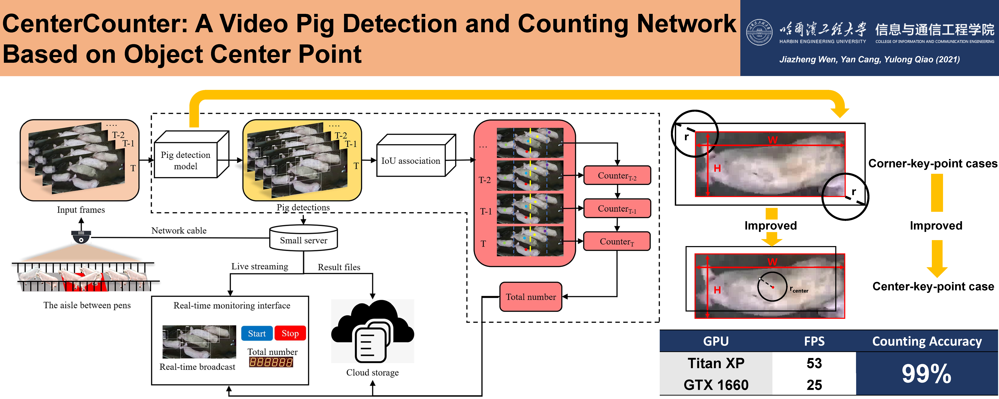
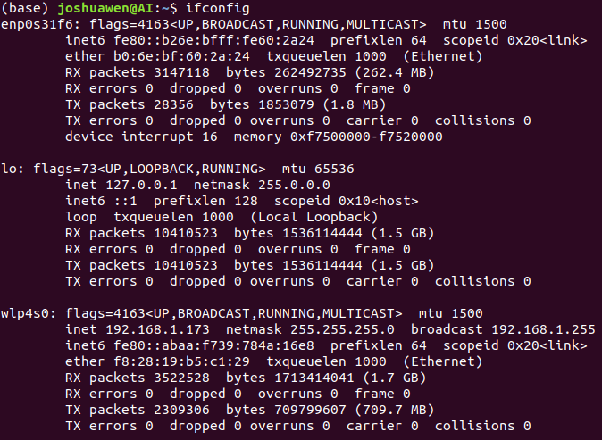

# <div align="center">PCIA</div>
<div align="center">The cooperation project of Harbin Engineering University and Beijing Focused Loong Technology Company Limited.</div>

## <div align="center">What is PCIA ?</div>



**PCIA is an acronym for Pig Counting In Aisles.**

The purpose of this project is to continuously count the moving objects in aisles in a fixed-view video scene, 
and specify the positive direction of movement, 
which means that the objects moving in the opposite direction should be counted down.

## <div align="center">How to install PCIA ?</div>

PCIA is divided into an online version and a local version. 
Due to the instability of the on-site network, 
only the local version is usually deployed on the device to prevent interruption of cloud uploading and streaming caused by network abnormalities.

<details open>
<summary>Local Version Install</summary>

**Step 0: System Check. (Usually the staff of the company will do it for you, so you can jump to Step 1.)**

First, check whether the Ubuntu system is installed in the solid state drive, if installed in the mechanical disk, please reinstall the system.
After that, turn off the Secure Boot entry in the system BIOS.

Solve the problem that Sunflower cannot connect after restart:
```bash
sudo apt-get update
sudo apt-get upgrade
sudo apt-get install lightdm
```

**Step 1: NVIDIA Graph Device Driver Install**

Change the system source to Aliyun source: Click the Software & Updates icon, select the Download from item in the interface as http://mirrors.aliyun.com/ubuntu, click Close, and click Reload.

Click the Software & Updates icon again, select Additional Drivers, and click to download the 450, 460, and 470 NVIDIA graphics card drivers. After the installation is successful, restart the host.
After restarting, click the Setting icon to see if the Graphics item has changed to the NVIDIA driver, and type in the terminal:

```bash
nvidia-smi
```

Check whether the graphics card usage information can be viewed. If all are satisfied, the graphics card driver is installed successfully.

**Step 2: Anaconda Install**

Download the latest installation package from the Anaconda official website and run the command in the terminal:

```bash
bash {Anconda Package Name}.sh
```

Select yes in the whole process, restart the terminal, if the line header appears (base), the installation is successful.

**Step 3: Pycharm Install**

Download the latest version from the JetBrain official website, copy it to the directory where your home is located, and run the command in the terminal to decompress it:

```bash
sudo tar zxvf {Pycharm Package Name}.tar.gz
cd {Unzipped dictory name}/bin
sh ./pycharm.sh
```

**Remember to log in to pycharm with your student account to activate the product.**

**Step 4: CUDA and cuDNN Install（Please ensure that Step 1 is completed properly.）**

Download the CUDA-11.0 version from the CUDA archive on the NVIDIA official website and install it according to the official requirements.

Download the latest version of cuDNN corresponding to CUDA-11.0 from the NVIDIA official website, and enter:

```bash
tar zxvf {cuDNN Package Name}.tar.gz
sudo cp cuda/include/cudnn* /usr/local/cuda-11.0/include/
sudo cp cuda/lib64/libcudnn* /usr/local/cuda-11.0/lib64/
sudo chmod a+r /usr/local/cuda-11.0/include/cudnn*
sudo chmod a+r /usr/local/cuda-11.0/lib64/libcudnn*
```

Add environment variables, terminal input:

```bash
sudo gedit ~/.bashrc
```
Add text in the blanks of the document:

```bash
# CUDA config
export LD_LIBRARY_PATH=$LD_LIBRARY_PATH:/usr/local/cuda-11.0/lib64
export PATH=$PATH:/usr/local/cuda-11.0/bin
export CUDA_HOME=$CUDA_HOME:/usr/local/cuda-11.0
```

**Step 5: Git Install**

Terminal input：

```bash
sudo apt install git
```

**Step 6: Replace the source of conda**

Terminal input：

```bash
conda config --add channels https://mirrors.tuna.tsinghua.edu.cn/anaconda/pkgs/free/
conda config --add channels https://mirrors.tuna.tsinghua.edu.cn/anaconda/pkgs/main/
conda config --add channels https://mirrors.tuna.tsinghua.edu.cn/anaconda/cloud/conda-forge/
conda config --add channels https://mirrors.tuna.tsinghua.edu.cn/anaconda/cloud/pytorch/
conda config --set show_channel_urls yes
```

**Step 7: Replace the source of pip**

Create a .pip folder in the home directory, and create a pip.conf file in the folder with the following contents:

```bash
[global]
timeout = 6000
index-url = https://pypi.tuna.tsinghua.edu.cn/simple
trusted-host = pypi.tuna.tsinghua.edu.cn
```

</details>

<details open>
<summary>Local version install - source install</summary>

**Step 1: Source code clone**

You can directly copy the PCIA-local folder from the code folder under this repo as the source code folder.

Or clone from my other repo (not yet open to clone):

```bash
git clone https://github.com/JoshuaWenHIT/PCIA-local.git
```

**Step 2: Operating environment configuration**

Relevant library installation:

```bash
pip install -r requirements.txt
```

Deep learning framework installation (recommended to use the version I specified):

```bash
conda install pytorch==1.2.0 torchvision==0.4.0 cudatoolkit=10.0 cudnn=7.6.5
```

Push stream library installation (recommended to use the version I specified):

```bash
conda install ffmpeg==4.3.1
```

**Step 3: DCNv2 compilation (can be omitted, try to run this step when demo.py runs incorrectly)**

Terminal input:

```bash
cd DCNv2
export CUDA_HOME=/usr/local/cuda-11.0
python setup.py build develop
```

If there are no problems with the previous steps, this step will naturally succeed. If it fails, check the steps from the beginning for any inconsistencies.

</details>

## <div align="center">How to test PCIA ?</div>

After completing the installation steps, preliminary testing of the deployed code is required.
This part of the test is mainly divided into three parts: demo test, main test and upload test.
<details open>
<summary>demo test</summary>

The demo.py file uses test2.mp4 as the test video by default, which can be run directly:

```bash
python demo.py
```

The test result will generate the test2_res.mp4 result video in the ./video folder. If the whole calculation process is normal and the result video is normal, the demo test will pass.

It is worth mentioning that the demo test is mainly used to test whether the deployment of the counting network is successful, and does not involve tasks such as communication, streaming, and cloud uploading in the PCIA product part.
This part of the test is mainly completed in the main test.


</details>

<details open>
<summary>main test</summary>

The main test can be divided into three steps: 1) code authorization; 2) code startup; 3) joint debugging.

**Step 1: Code authorization**

This part involves the code encryption part in ./lib/model.py. The content of the encryption part will be explained in detail in the "How to encrypt PCIA?" section. Here, only the generation of the license.lic file used for running is explained.

In the ./code folder, the encode folder represents the encryption function file. Before generating the license.lic file, you need to know the mac address of the deployment host:
```bash
ifconfig
```

<div align="center">

</div>

Take the above figure as an example, three sets of parameters are obtained respectively, among which enp0s31f6 is the model of the network card in use, and the model will vary according to different devices.

**Please pay attention to your device network card model! ! ! And modify it in line87 of ./lib/model.py in PCIA-local folder! ! !**

The mac address is represented after ether: b0:6e:bf:60:2a:24, after obtaining the mac address, enter it in the terminal (in the encode root directory):

```bash
python CreateLicense.py $your_macAddress-$month-$day # e.g. b06ebf602a24-05-01
```

Among them, $your_macAddress fills in the mac address of the deployed device, and $month-$day fills in the authorization expiration date of the license.lic file (if you want permanent authorization, you can fill in 13-01, which is a month that does not exist in normal months).
After running, you can obtain the license.lic file in the encode root directory, and copy the file to the PCIA-local root directory to complete the authorization.

**Step 2: Program start**

After completing the authorization, modify it in main.py: 1) modify the mac address of line18; 2) modify the camera address of line20. When done, type in the terminal:

```bash
python main.py
```

If it runs normally, you can observe the following output:

```bash
已授权!
生成模型...
加载模型 ./weights/pcia_v7_b

模型加载完毕!
等待接收服务器指令......
```

**Step 3: Joint debugging**

It is necessary to contact the company personnel for cooperative testing, and the company staff will use the tablet to control the start and end of the algorithm, which requires practical operation drills.

</details>

<details open>
<summary>upload test</summary>

**It is necessary to ensure that there are legally named videos under ./video/output. It is recommended to perform joint debugging in step 3 of the main test! ! !**

Terminal input:

```bash
python upload.py
```

If the terminal shows that the upload is successful, it means that the upload test has passed.

</details>

## <div align="center">How to encode PCIA ?</div>

After the test work is completed, the library file code and the network weight file need to be encrypted from the perspective of technical confidentiality.

In "How to test PCIA?", the code authorization method is explained, and the remaining 2 aspects will be explained below: 1) code encryption; 2) model encryption.

<details open>
<summary>Code encryption</summary>

Code encryption mainly encrypts the .py file into a .so library file through the Cython method, and runs it on the terminal. Copy the .py file to be encrypted to the process folder under encode/encryptionforcode, and run the terminal:

```bash
python encryptcode.py build_ext --inplace
```

You can obtain the encrypted .so file in the process folder and replace it with the .py file in the ./lib of PCIA-local to complete the code encryption.

</details>

<details open>
<summary>Model encryption</summary>

Model encryption mainly encrypts the .pth file into a weight file without a suffix name through the password hash check method. The encrypted file already exists in the ./weights folder in PCIA-local.
Copy the .pth file to be encrypted to the encode/encryptionformodel/encryption/temp folder,
Modify line15 in encode/encryptionformodel/encryption/main.py to customize the input weight file name and output file path,
Finally the terminal runs:

```bash
python main.py # Note that the main.py file path here is encode/encryptionformodel/encryption/main.py, please do not confuse it with main.py under PCIA-local
```

You can obtain the encrypted model weight file in the temp folder, and replace the .pth file in ./weights of PCIA-local to complete the model encryption.

</details>

**It is recommended to perform the above test again after encryption to ensure that the encryption is correct! ! !**